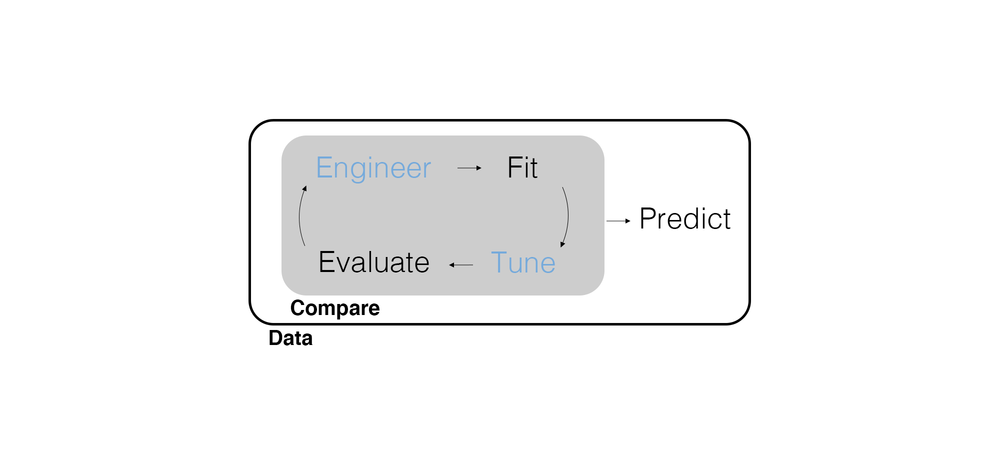
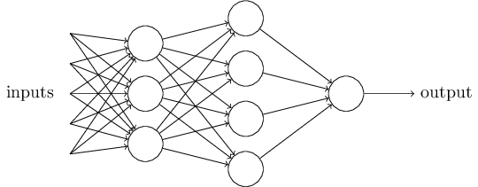
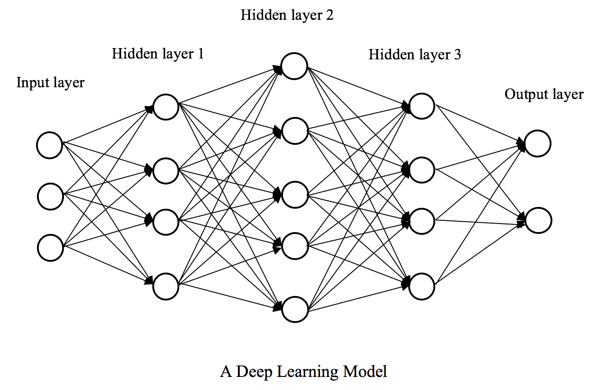

## Marketing Analytics Process

<center>
{width=900px}
</center>

## Predictive Modeling Workflow

<center>
{width=900px}
</center>

---

{width=500px}

## Deep Learning

**Deep learning** is a type of machine learning that uses **neural networks** to essentially automate feature engineering by progressively extracting regular features from the data.

- A key focus for **artificial intelligence**, which has been studied for a long time, is to create a model that mimics the way the human mind works.
- Neural networks are a result of these (mixed results) efforts, with **hidden units** (a.k.a., neurons) encoding different feature engineering-like transformations of the data in order to predict the outcome.

Simple, *right*?!

## A Neuron Model

<center>
{width=500px}
</center>

- $x_1$ through $x_3$ are the *predictor* inputs.
- The *output* is the outcome variable $y$.
- The neuron *combines* the inputs with some weight for each and then *transforms* the combination before passing it on.
- Together this **combination function** and **transfer function** are called an **activation function**.

---

Each neuron is a linear combination of the inputs (and then a transformation) based on a given activation function.

<center>
{width=500px}
</center>

If we have a binary outcome variable with a **softmax** (i.e., logistic) activation function, this neural network would be logistic regression.

## Neural Networks

What makes it a neural *network* is including multiple neurons (i.e., hidden units) and potentially multiple **hidden layers** (hidden just means they aren't inputs or outputs).

<center>
{width=500px}
</center>

- Each hidden unit has its own activation function.
- Each hidden layer takes the outputs of the previous layer as inputs.

This sequence of activation functions can approximate any function, essentially learning the feature engineering that results in better predictions.

---

Having more than one hidden layer is what makes a neural network *deep*.

<center>
{width=500px}
</center>

Let's [visualize how this works](https://www.youtube.com/watch?v=sDDjJRnnHao).

## Ready to Train a Neural Network?

Install the `nnet` package!

## Preliminaries

Load libraries and set a random seed.

```{r message=FALSE, warning=FALSE}
# Load packages, set seed.
library(tidyverse)
library(tidymodels)
set.seed(42)
```

## Data Wrangling

```{r message=FALSE, warning=FALSE}
# Import data, wrangle S1 into segment, coerce factors, and select predictors.
roomba_survey <- read_csv(here::here("Data", "roomba_survey.csv")) |> 
  rename(segment = S1) |> 
  mutate(
    segment = case_when(
      segment == 1 ~ "own",
      segment == 3 ~ "shopping",
      segment == 4 ~ "considering"
    ),
    segment = factor(segment),
    D2HomeType = factor(D2HomeType),
    D3Neighborhood = factor(D3Neighborhood),
    D4MaritalStatus = factor(D4MaritalStatus),
    D6Education = factor(D6Education)
  ) |> 
  select(
    segment, contains("RelatedBehaviors"), contains("ShoppingAttitudes"), 
    D1Gender, D2HomeType, D3Neighborhood, D4MaritalStatus, D6Education
  )
```

## Feature Engineering

**Normalizing** all of the predictors is common for neural networks. Why?

- Improved training speed.
- Stabilization of model training.
- Prevents one feature from dominating the model.

$X^{norm} = \frac{X - \mu_X}{\sigma_X}$

---

```{r}
# Split data based on segment.
roomba_split <- initial_split(roomba_survey, prop = 0.75, strata = segment)

# Feature engineering.
roomba_recipe <- training(roomba_split) |>
  recipe(
    segment ~ .
  ) |>
  step_dummy(all_nominal_predictors()) |> 
  step_normalize(all_predictors())
```

## Fit a Multilayer Perceptron

There are *many* different types of neural networks. A common one is a **multilayer perceptron**, which has a single hidden layer.

```{r}
# Set the model, engine, and mode.
nn_model_01 <- mlp() |> 
  set_engine(engine = "nnet") |> 
  set_mode("classification")

nn_model_01
```

---

Create a workflow that combines the recipe and model and fit it.

```{r}
# Create a workflow.
nn_wf_01 <- workflow() |> 
  add_recipe(roomba_recipe) |> 
  add_model(nn_model_01)

# Fit the workflow.
nn_fit_01 <- fit(nn_wf_01, data = training(roomba_split))
```

## What's Our Next Step?

## Model Evaluation

So far, we have repeated the same steps every time we want to evaluate a model.

* Generate predictions from the fitted model for the `test` data
* Join the predictions as a new column in the `test` data
* Compute the accuracy using the prediction column and the column of true values

What **coding tool** can we use to simplify this process a little bit?

## Functions Redux

- We should try to write functions that are as *general* as possible.
- To use tidy functions inside of our functions, note that we use `{{ }}` around variables that are used as arguments.

```{r}
fit_accuracy <- function(fit, testing_data, truth) {
  fit |> 
    predict(new_data = testing_data) |>
    bind_cols(testing_data) |>
    accuracy(truth = {{truth}}, estimate = .pred_class)
}
```

## Evaluate Predictive Fit

Let's look at the accuracy on the testing data.

```{r}
# Compute model accuracy.
fit_accuracy(nn_fit_01, testing(roomba_split), segment)
```

## Hyperparameter Tuning

There are a *lot* of [potential hyperparameters to tune](https://playground.tensorflow.org), but we'll focus on three.

- `hidden_units` the number of hidden units in the single layer
- `epochs` the number of of training iterations
- `penalty` a penalty term to help fight overfitting

The `activation` function is set based on the model mode. It isn't a numeric value that can be tuned, but you can try `"relu"` instead of the default of `"linear"` for regression and `"softmax"` for classification.
  
---

```{r}
# Use v-fold cross-validation based on segment.
roomba_cv <- vfold_cv(training(roomba_split), v = 10, strata = segment)

# Set the model, engine, and mode.
nn_model_02 <- mlp(hidden_units = tune(), epochs = tune(), penalty = tune()) |> 
  set_engine(engine = "nnet") |> 
  set_mode("classification")

# Update the workflow.
nn_wf_02 <- nn_wf_01 |> 
  update_model(nn_model_02)

# Tune the hyperparameters by using the cross-validation.
nn_tune <- nn_wf_02 |> 
  tune_grid(resamples = roomba_cv)
```

---

Select the best model and finalize our workflow.

```{r}
# Select the best fitting model.
nn_tune_best <- nn_tune |> 
  select_best(metric = "accuracy")

# Finalize the workflow.
nn_wf_final <- nn_wf_02 |> 
  finalize_workflow(nn_tune_best)

nn_wf_final
```

---

Now let's fit on the entire training data.

```{r}
# Fit the tuned workflow to the whole dataset.
nn_fit_02 <- fit(nn_wf_final, data = training(roomba_split))

# Compute model accuracy.
fit_accuracy(nn_fit_02, testing(roomba_split), segment)
```

## Final Thoughts

Neural networks can be powerful prediction engines. However, they often require a *lot* of data and can be slow to train. As with every predictive model, there is no guarantee it will predict best for a given application.

While adding additional hidden units can help uncover finer structures in the data, adding additional hidden layers allows for increasingly nonlinear relationships between the predictors and the outcome.

However, additional hidden layers will require a neural network more sophisticated than a multilayer perceptron.

---

{width=500px}

---

<center>
{width=800px}
</center>

## Wrapping Up

*Summary*

- Introduced deep learning and neural networks.
- Demonstrated running a multilayer perceptron, including hyperparameter tuning.

*Next Time*

- Ensembles.

*Supplementary Material*

- [TensorFlow for R](https://tensorflow.rstudio.com/tutorials/)

## Exercise 19

Return to the set of models from the previous two exercises.

1. Be sure you're making a fair comparison by fitting the previous models (hyperparameter tuning included, where applicable), on the same random training and testing split using the same recipe (i.e., you want to normalize the data for a neural net specifically but it's not going to hurt when running the other models).
2. Fit a tuned multilayer perceptron. Create a data frame comparing all the models. Which is the best-fitting model so far? Use confusion matrices to explore how the best-fitting model is doing better than the competing models. Interpret what you find.
3. Render the Quarto document into Word and upload to Canvas.

