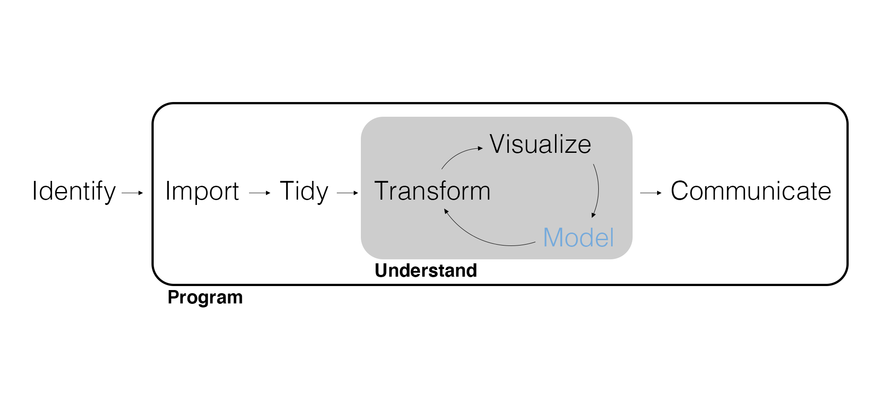
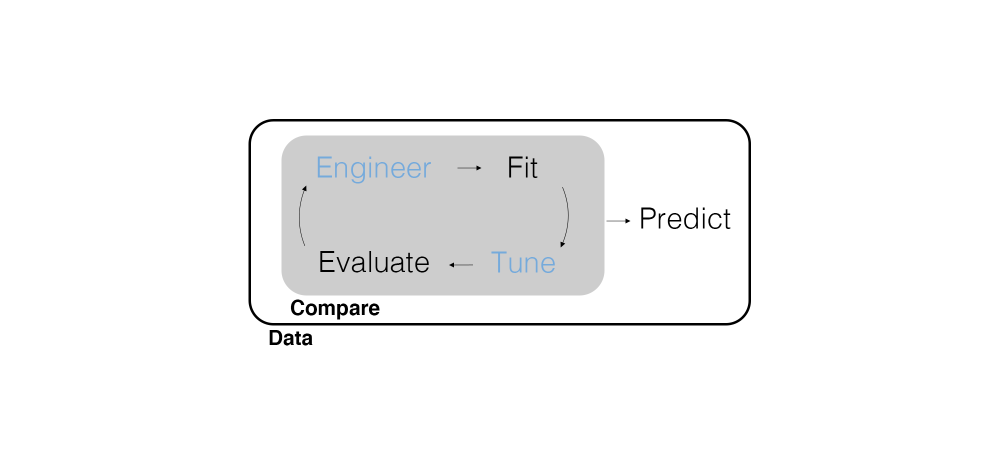
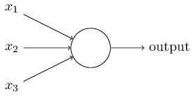
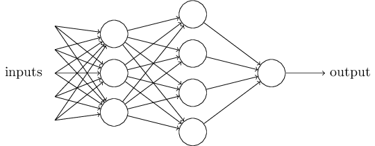
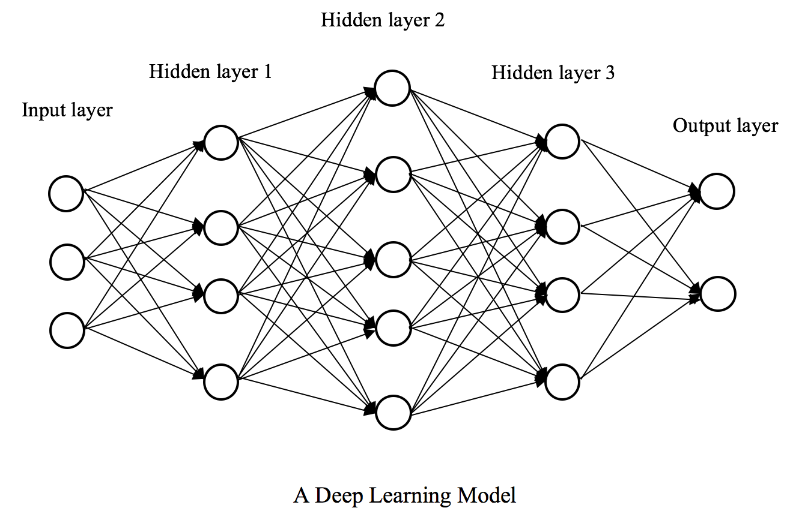

## Marketing Analytics Process

<center>
{width=900px}
</center>

## Predictive Modeling Workflow

<center>
{width=900px}
</center>

---

{width=500px}

## Deep Learning

**Deep learning** is a type of machine learning that uses **neural networks** to essentially automate feature engineering by progressively extracting regular features from the data.

- A key focus for **artificial intelligence**, which has been studied for a long time, is to create a model that mimics the way the human mind works.
- Neural networks are a result of these efforts, with **hidden units** (a.k.a., neurons) encoding different feature engineering-like transformations of the data in order to predict the outcome.

Simple, *right*?!

## A Neuron Model

<center>
{width=500px}
</center>

- $x_1$ through $x_3$ are the *predictor* inputs.
- The *output* is the outcome variable $y$.
- The neuron *combines* the inputs with weights and then *transforms* the combination before passing it on.
- Together this **combination function** and **transfer function** are called an **activation function**.

---

Each neuron is a linear combination of the inputs (and then a transformation) based on a given activation function.

<center>
{width=500px}
</center>

Neural networks can be similar to models we've already seen!

- Linear regression
- Logistic regression

## Neural Networks

To get a *neural network* we utilize multiple neurons (i.e., hidden units) and potentially multiple **hidden layers** (hidden just means they aren't direct inputs or outputs).

<center>
{width=500px}
</center>

- Each hidden unit has its own activation function.
- Each hidden layer takes the outputs of the previous layer as inputs.

This sequence of activation functions can approximate any function, essentially learning the feature engineering that results in better predictions.

---

Having more than one hidden layer is what makes a neural network *deep*.

<center>
{width=500px}
</center>

Let's [visualize how this works](https://www.youtube.com/shorts/hRIJc9jRpts).

---

Having more than one hidden layer is what makes a neural network *deep*.

<center>
{width=500px}
</center>

Let's [visualize how this works](https://www.youtube.com/watch?v=sDDjJRnnHao).

## Ready to Train a Neural Network?

Install the `nnet` package!

## Preliminaries

Load libraries.

```{r message=FALSE, warning=FALSE}
# Load packages, set seed.
library(tidyverse)
library(tidymodels)
```

## Data Wrangling

```{r message=FALSE, warning=FALSE}
# Import data, wrangle S1 into segment, coerce factors, and select predictors.
roomba_survey <- read_csv("roomba_survey.csv") |> 
  rename(segment = S1) |> 
  mutate(
    segment = case_when(
      segment == 1 ~ "own",
      segment == 3 ~ "shopping",
      segment == 4 ~ "considering"),
    # convert numeric categorical variables into factors for dummies
    segment = factor(segment),
    D2HomeType = factor(D2HomeType),
    D3Neighborhood = factor(D3Neighborhood),
    D4MaritalStatus = factor(D4MaritalStatus),
    D6Education = factor(D6Education)) |> 
  select(
    segment, contains("RelatedBehaviors"), contains("ShoppingAttitudes"), 
    D1Gender, D2HomeType, D3Neighborhood, D4MaritalStatus, D6Education
  )
```

## Feature Engineering

**Normalizing** all of the predictors is common for neural networks. Why?

- Improved training speed.
- Stabilization of model training.
- Prevents one feature from dominating the model.

$X^{norm} = \frac{X - \mu_X}{\sigma_X}$

---

```{r}
set.seed(42)

# Split data based on segment.
roomba_split <- initial_split(roomba_survey, prop = 0.75, strata = segment)

# Feature engineering.
roomba_recipe <- training(roomba_split) |>
  recipe(
    segment ~ .
  ) |>
  # create dummy variables - using all_nominal_predictors(),
  # rather than all_nominal(), -segment
  step_dummy(all_nominal_predictors()) |> 
  # remove variables that have a single value (zero variance) - why?
  step_zv(all_predictors()) |>
  # normalize all predictors
  step_normalize(all_predictors())
```

## Fit a Multilayer Perceptron

There are *many* different types of neural networks. A common one is a **multilayer perceptron**, which has a single hidden layer.

```{r}
# Set the model, engine, and mode.
nn_model_01 <- mlp() |> 
  set_engine(engine = "nnet") |> 
  set_mode("classification")

nn_model_01
```

---

Create a workflow that combines the recipe and model and fit it.

```{r}
# Create a workflow.
nn_wf_01 <- workflow() |> 
  add_recipe(roomba_recipe) |> 
  add_model(nn_model_01)

# Fit the workflow.
nn_fit_01 <- fit(nn_wf_01, data = training(roomba_split))
```

## What's Our Next Step?

## Model Evaluation

So far, we have repeated the same steps every time we want to evaluate a model.

* Generate predictions from the fitted model for the `test` data
* Join the predictions as a new column in the `test` data
* Compute the accuracy using the prediction column and the column of true values

What **coding tool** can we use to simplify this process a little bit?

## Functions Review

- We should try to write functions that are as *general* as possible.
- To create a `tidy` function, i.e., a function that can accept an un-quoted variable name as an argument place `{{ }}` around that variable name wherever it occurs in the function.

```{r}
fit_accuracy <- function(fit, testing_data, truth) {
  ###
  # - fit: a fitted model
  # - testing_data: test data for which predictions will be generated
  # - truth: name of the target (Y) variable contained in testing_data
  eval_results <- fit |> 
    predict(new_data = testing_data) |>
    bind_cols(testing_data) |>
    accuracy(truth = {{truth}}, estimate = .pred_class)
  
  return(eval_results)
}
```

## Evaluate Predictive Fit

Let's look at the accuracy on the testing data.

```{r}
# Compute model accuracy.
fit_accuracy(nn_fit_01, testing(roomba_split), segment)
```

**OOF!**

## Hyperparameter Tuning

There are a *lot* of [potential hyperparameters to tune](https://playground.tensorflow.org), but we'll focus on three.

- `hidden_units` the number of hidden units in the single layer
- `epochs` the number of training iterations
- `penalty` a penalty term to help fight overfitting

The `activation` function is set based on the model mode. You can experiment with `"relu"` instead of the default of `"linear"` for regression and `"softmax"` for classification.

## How Do We Tune Ourselves Spiritually?

"Teaching, exhorting, and explaining - as important as they are - can never convey to an investigator, a child, a student, or a member a witness of the truthfulness of the restored gospel. Only as their faith initiates action and opens the pathway to the heart can the Holy Ghost deliver confirming witnesses. Missionaries, parents, teachers, and leaders obviously must learn to teach by the power of the Spirit. Of equal importance, however, is the responsibility they have to help others learn for themselves by faith."

Elder Bednar, "Learning in the Lord's Way", October 2018.
  
---

```{r}
# Use v-fold cross-validation based on segment.
roomba_cv <- vfold_cv(training(roomba_split), v = 10, strata = segment)

# Set the model, engine, and mode.
nn_model_02 <- mlp(hidden_units = tune(), epochs = tune(), penalty = tune()) |> 
  set_engine(engine = "nnet") |> 
  set_mode("classification")

# Update the workflow.
nn_wf_02 <- nn_wf_01 |> 
  update_model(nn_model_02)

# Tune the hyperparameters by using the cross-validation.
nn_tune <- nn_wf_02 |> 
  tune_grid(resamples = roomba_cv)
```

---

```{r}
nn_tune |>
  collect_metrics(summarize = FALSE) |>
  filter(.metric == "accuracy") |>
  group_by(.config) |>
  summarize(avg_accuracy = mean(.estimate)) |>
  arrange(desc(avg_accuracy))
```

---

Select the best model and finalize our workflow.

```{r}
# Select the best fitting model.
nn_tune_best <- nn_tune |> 
  select_best(metric = "accuracy")

# Finalize the workflow.
nn_wf_final <- nn_wf_02 |> 
  finalize_workflow(nn_tune_best)

nn_wf_final
```

---

Now let's fit on the entire training data.

```{r}
# Fit the tuned workflow to the whole dataset.
nn_fit_02 <- fit(nn_wf_final, data = training(roomba_split))

# Compute model accuracy.
fit_accuracy(nn_fit_02, testing(roomba_split), segment)
```

## Final Thoughts

Neural networks can be powerful prediction engines. However, they often require a *lot* of data and can be slow to train. As with every predictive model, there is no guarantee it will predict best for a given application.

Adding additional hidden units can help uncover finer structures in the data and allow for nonlinear relationships between the predictors and the outcome.

However, additional hidden layers will require a neural network more sophisticated than a multilayer perceptron, and increase the risk of overfitting.

## Wrapping Up

*Summary*

- Introduced deep learning and neural networks.
- Demonstrated running a multilayer perceptron, including hyperparameter tuning.

*Next Time*

- Ensembles.

*Supplementary Material*

- [TensorFlow for R](https://tensorflow.rstudio.com/tutorials/)

## True or False?

Your life is influenced by a neural network *every day*.

## True or False?

Your life is influenced by a neural network *every day*.

Let's [see just one example](https://www.youtube.com/watch?v=LPZh9BOjkQs).

## Exercise 16

Return to the set of models from the previous two exercises.

1. Set up workflows for a decision tree, a random forest, and a neural network. Be sure you're making a fair comparison by fitting the previous models (hyperparameter tuning included, where applicable), on the same random training and testing split using the same recipe (i.e., you should create dummies, remove constant features, and standardize features for all models.
2. Train and tune each model (except the logistic regression since it doesn't have hyperparameters) using cross-validation on the training data.
3. Create a data frame comparing the performance of all three models on the test data. Which is the best-fitting model so far? Use confusion matrices to explore how the best-fitting model is doing better than the competing models. Interpret what you find. For example, is one of the models notably better at predicting one or more of the segments of interest?
4. Render the Quarto document into Word and upload to Canvas.

## Live Coding

Let's compare our most complicated model (neural network) to our simplest model (logistic regression) to predict response to the most recent marketing campaign in the iFood data.

```{r}
# Load packages.

# Set the seed.

# Import data and wrangle our dependent variable

# Split data

# Create v-fold cross-validation

# create recipe (Feature engineering)
```

Logistic regression modeling.

```{r}
# create model

# create workflow

# fit workflow to CV folds

# compute accuracy
```

Neural network modeling.

```{r}
# repeat the above for the neural network, with tuning
```

Which model did better? Use the best model on the test data.
